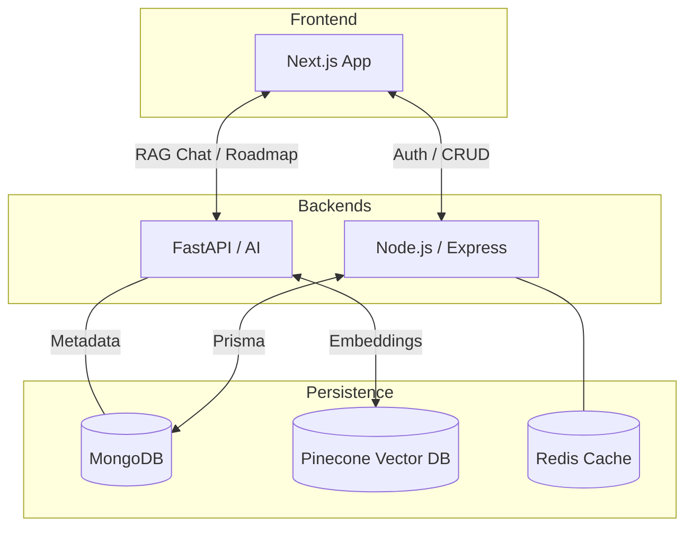
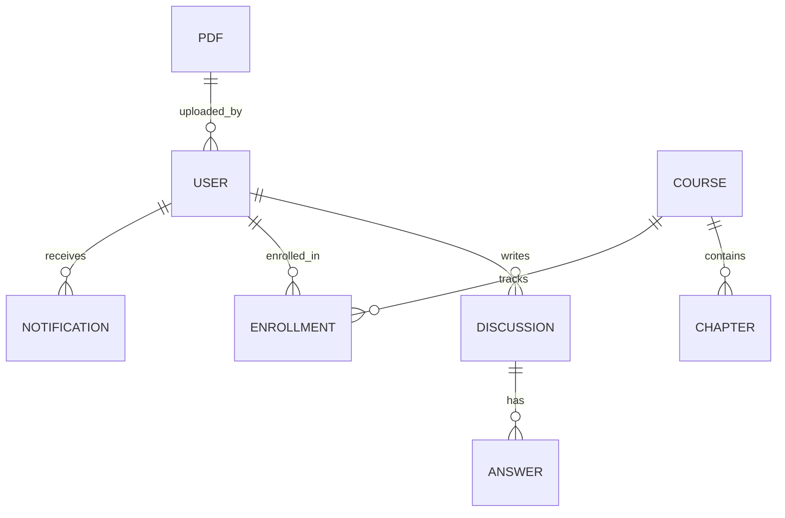

# Edulume - AI-Powered Educational Platform

<div align="center">


[](https://swoc.tech)
[](LICENSE)
[](CONTRIBUTING.md)

[](https://react.dev)
[](https://www.typescriptlang.org/)
[](https://expressjs.com/)
[](https://fastapi.tiangolo.com/)
[](https://www.mongodb.com/)
[](https://www.prisma.io/)

**A comprehensive full-stack educational platform combining resource sharing, interactive discussions, AI-powered learning, and structured course/roadmap creation.**

[Live Demo](https://edulume.site) • [Report Bug](https://github.com/tarinagarwal/edulume/issues/new) • [Request Feature](https://github.com/tarinagarwal/edulume/issues/new)

</div>

---

## 🌟 Features

### Core Features

- **User Authentication** - Local signup/login with OTP verification + Google OAuth
- **Resource Sharing** - Upload and browse PDFs/ebooks by semester, course, department
- **Discussion Forum** - Community Q&A with voting, best answers, and @mentions
- **Courses** - Create structured courses with AI-generated content and progress tracking
- **Roadmaps** - Generate learning roadmaps with resources, tools, and career guidance
- **AI PDF Chatbot** - Chat with uploaded PDFs using RAG (Retrieval-Augmented Generation)
- **Admin Panel** - Manage users, content, feature suggestions, and bug reports

### Advanced Features

- **Real-time Updates** - WebSocket support for live notifications
- **AI Content Generation** - Groq-powered course outlines and chapter content
- **Vector Database** - Pinecone integration for semantic PDF search
- **Caching** - Redis caching for improved performance
- **Email Notifications** - OTP and notification emails via SMTP
- **File Storage** - Cloudinary and R2 (Backblaze) integration
- **SEO Optimization** - Sitemap generation and metadata

---

## 🏗️ System Architecture & Logic Flow

To navigate our monorepo efficiently, understand how data flows between the three core services:



---

## 🛠️ Contribution Roadmap (Find Your Fit)

New to the project? Use this table to find issues that match your specific skills and interest areas. This helps you skip the "Configuration Fatigue" and jump straight into coding.

| Category | Tech Stack | Quick Start Tasks |
| :--- | :--- | :--- |
| **🎨 Frontend** | React 19, Tailwind 4 | UI/UX improvements, Framer Motion animations, Responsive fixes |
| **⚙️ Backend** | Express, Prisma, Redis | API optimization, Webhook integrations, Database indexing |
| **🧠 AI/Data** | Python, FastAPI, RAG | Prompt tuning, LangChain flow improvements, Vector DB logic |
| **📝 Docs/DevOps** | Markdown, Docker | Improving setup scripts, writing test cases, Mermaid.js diagrams |


---

## 🚀 Quick Start (Anti-Fatigue Setup)

Edulume is a large monorepo. To avoid "Configuration Fatigue," we recommend starting with a **Lite Setup** unless you are specifically working on AI features.

### Prerequisites
- Node.js v20.12.2+
- Python 3.11+
- MongoDB (local or Atlas)
- Git

### 🧩 The "Mock Mode" Strategy
Don't have all 10+ API keys (Groq, Pinecone, OpenAI, etc.)? **You can still contribute!**
* **Lite Setup:** Fill only the `DATABASE_URL` and `JWT_SECRET` in your `.env` file.
* **Impact:** Core features like the **Discussion Forum**, **Resource Uploads**, and **User Profiles** will work perfectly without any AI keys.
* **AI Tasks:** You only need the full API suite if you are specifically testing the RAG Chatbot, PDF interactions, or Roadmap generator.

### Installation
Follow these steps to get the environment running in under 10 minutes:
# 1. Clone & Root setup
```
git clone [https://github.com/tarinagarwal/edulume.git](https://github.com/tarinagarwal/edulume.git)
cd edulume
```

# 2. Frontend (Terminal 1)
```
cd client
npm install
npm run dev
```

# 3. Backend (Terminal 2)
```
cd server
npm install
npm run db:generate
npm run dev
```

# 4. AI Backend (Terminal 3) - Optional for non-AI tasks
```
cd python-backend
python -m venv venv
source venv/bin/activate  # Windows: venv\Scripts\activate
pip install -r requirements.txt
uvicorn main:app --reload
```

---

## 🔌 API Overview

| Module          | Endpoints                      | Description                               |
| --------------- | ------------------------------ | ----------------------------------------- |
| **Auth**        | `/api/auth/*`                  | Signup, login, OAuth, OTP, password reset |
| **Resources**   | `/api/pdfs/*`, `/api/ebooks/*` | PDF and ebook management                  |
| **Discussions** | `/api/discussions/*`           | Forum with voting and notifications       |
| **Courses**     | `/api/courses/*`               | Course creation, enrollment, progress     |
| **Roadmaps**    | `/api/roadmaps/*`              | Learning roadmap generation               |
| **Feedback**    | `/api/feedback/*`              | Feature suggestions and bug reports       |
| **AI Chat**     | `/api/pdf-chat/*`              | RAG-based PDF chatbot                     |

---

## 📊 Database Schema
We use **Prisma** with **MongoDB** to maintain structured relationships and ensure data integrity. Understanding these models is essential for any backend-related contributions.



### 📊 Database Models

| Model                        | Description                 |
| ---------------------------- | --------------------------- |
| User                         | Authentication and profiles |
| Discussion, Answer, Reply    | Forum system                |
| Course, Chapter, Enrollment  | Course management           |
| Roadmap, RoadmapBookmark     | Learning paths              |
| Pdf, Ebook                   | Resource storage            |
| Notification                 | Real-time alerts            |
| FeatureSuggestion, BugReport | Feedback system             |

---

## 🔐 Environment Variables

Key environment variables needed:

| Variable                  | Description               |
| ------------------------- | ------------------------- |
| `DATABASE_URL`            | MongoDB connection string |
| `JWT_SECRET`              | JWT signing secret        |
| `GROQ_API_KEY`            | Groq API for AI features  |
| `OPENAI_API_KEY`          | OpenAI for embeddings     |
| `PINECONE_API_KEY`        | Pinecone vector database  |
| `GOOGLE_CLIENT_ID/SECRET` | Google OAuth credentials  |

📖 **See [INSTALLATION.md](INSTALLATION.md) for complete environment setup**

---

## 📁 Project Directory Map
* 📂 `client/`: The visual heart. Built with Next.js 15.
* 📂 `server/`: The central nervous system. Handles Auth and Database logic.
* 📂 `python-backend/`: The AI engine. Processes PDFs and generates roadmaps.

---

## 🤝 Contributing (SWOC 2026)

We love PRs! Edulume is a community-driven project, and we welcome everyone from first-time contributors to experienced developers. To ensure your contribution is counted for **Social Winter of Code 2026**, please follow these steps:

1.  **Find an Issue:** Look for issues labeled `swoc2026`, `good first issue`, or `help wanted`.
2.  **Get Assigned:** Comment `I want to work on this` on the issue. Wait for a maintainer to assign it to you before you start coding.
3.  **Branching Strategy:** Always create a new branch for your work:
    ```bash
    git checkout -b feature/your-feature-name
    ```
4.  **Submit PR:** Link your Pull Request to the issue by adding `Closes #IssueNumber` in the description.

📖 **Read our [CONTRIBUTING.md](CONTRIBUTING.md) for the full developer guidelines and code of conduct.**

---

<div align="center">

**Built with ❤️ for the Global Student Community**

[](https://github.com/tarinagarwal/edulume/stargazers)
[](https://github.com/tarinagarwal/edulume/network/members)

</div>
